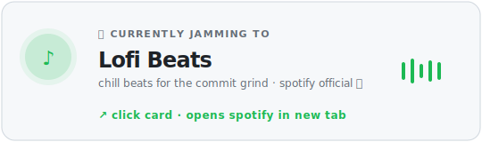

<h1 align="center">
    
</h1>

  <em>🛠 lowkey just commits &nbsp;·&nbsp; 🌱 highkey trying to ship &nbsp;·&nbsp; ☕ always learning fr</em>

  
  
  

 

  

  ↗ opens spotify · github readmes can't embed real players (it's a github limitation, not a skill issue 💀)

 

  

 

## 🔥 streak check

consecutive days locked in 🥵 · the flame hits harder the longer it goes

  

 

## 📊 my 2026 · vertical era

full-year scoreboard 💚 · each row = a month, each cell = a day, darker hits = more commits · iykyk

  

 

## 🐍 the snake era

watch my commits get devoured · classic move, never gets old

  <picture>
    <source media="(prefers-color-scheme: dark)" srcset="https://raw.githubusercontent.com/sung-jungmin/sung-jungmin/output/github-snake-dark.svg" />
    <source media="(prefers-color-scheme: light)" srcset="https://raw.githubusercontent.com/sung-jungmin/sung-jungmin/output/github-snake.svg" />
    
  </picture>

 

## 📈 monthly grind chart

which months did i go feral · jan→dec at a glance

  

 

## 📅 when i actually lock in

which weekday do i grind hardest? every contribution counted (commits + issues + PRs + reviews) — private org repos too, <strong>no cap</strong>. bucketed by EST weekday.

  

 

## 🏆 personal bests

flex zone · the highlights reel of 2026 so far

  

 

---

  
    ✨ this whole page rebuilds itself nightly from real github data — no third party widgets, just vibes
     
    ↻ auto-glows up daily at <strong>01:00 EST</strong> · all timestamps in EST · zero external services · zero npm deps
     
    built with <code>GitHub Actions</code> + a tiny node.js script — <a href="./scripts/">see scripts/</a> if ur curious 💅
  

