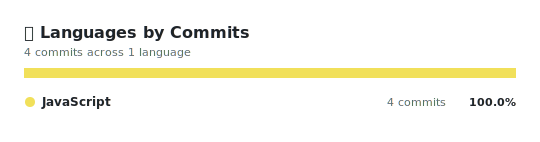
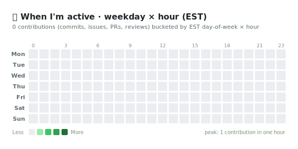

<h1 align="center">
  Hi there, I'm Jungmin Sung
  
</h1>

  <em>🛠 Mostly committing &nbsp;·&nbsp; 🌱 Sometimes shipping &nbsp;·&nbsp; ☕ Always learning</em>

  
  
  

 

## 📊 My 2026 Contribution Journey

  

 

## 🔥 Streak

  

 

## 💻 Languages by Commits

  

 

## ⏰ When I Code · Weekday × Hour (EST)

  

 

  ✨ Everything on this page is generated by <code>GitHub Actions</code> running a tiny Node.js script — see <a href="./scripts/">scripts/</a>
   
  ↻ Auto-refreshes every day at 01:00 EST · all dates and calculations use Eastern Time

